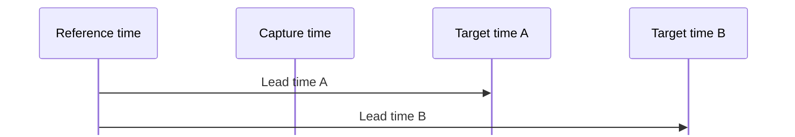
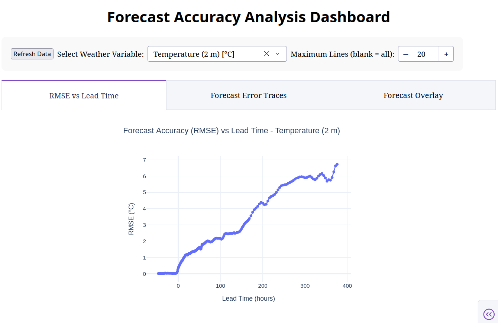
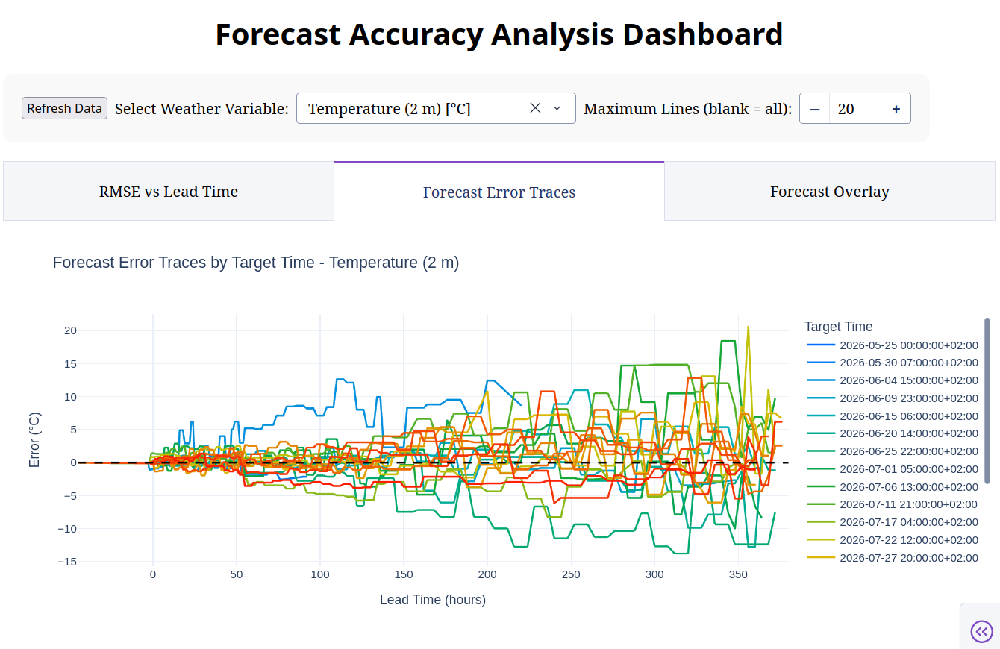
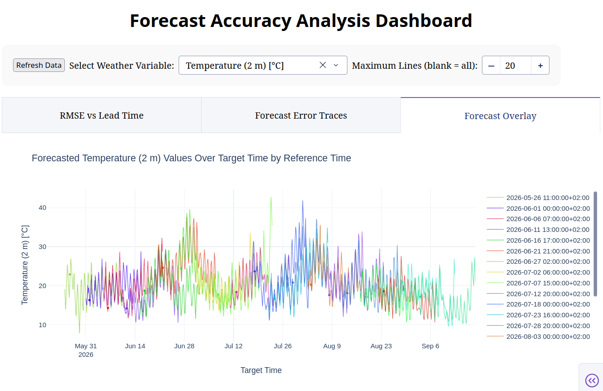

# Forecast Accuracy Degradation

Regularly collect weather forecasts from Open-Meteo in a SQLite database, then analyze how forecast accuracy changes with lead time. The analysis calculates RMSE and presents the results in an interactive Plotly Dash dashboard.

Instead of collecting every forecast manually, configure one cron job and let the tool keep collecting data automatically.

## Time Terminology

- **Capture time:** the exact time when the forecast is fetched.
- **Reference time:** the capture time rounded down to the start of its hour; this is when the forecast is considered to begin.
- **Target time:** the time for which a weather value is predicted.
- **Lead time:** the duration from reference time to target time.



## System Requirements

- Python 3.12 or newer
- [uv](https://docs.astral.sh/uv/) or pip for dependency management
- Internet access
- Cron or an equivalent scheduler for automatic collection
- Web browser

## Tech Stack

- **Data collection:** Python and Requests
- **Weather data:** Open-Meteo API
- **Storage:** SQLite
- **Analysis:** pandas and NumPy
- **Dashboard:** Plotly Dash
- **Environment:** uv or pip

## Installation

With uv:

```bash
uv sync --frozen
```

Alternatively, with pip:

```bash
python -m venv .venv
source .venv/bin/activate
python -m pip install -r requirements.txt
```

The commands below use `uv run python`. With the pip environment activated, use `python` instead. Maintainers can regenerate `requirements.txt` from `uv.lock` after dependency changes:

```bash
./scripts/generate-requirements.sh
```

## Configuration

Before creating the database, copy either `config.template.nyc.toml` or `config.template.warsaw.toml` to `config.toml`, then adjust the location and weather variables you want to track. Without `config.toml`, the application uses the defaults defined in `src/config.py`.

Transient API and response-decoding failures are retried automatically; permanent client errors fail immediately. Configure the number of retries with `[api].max_retries`. Delays increase exponentially from `[api].retry_base_delay` seconds unless the API supplies `Retry-After`, and each delay is capped at one hour.

## Set Up

Check your configuration and API connectivity without saving a forecast:

```bash
uv run python main.py --no-save
```

Then create the configured database without fetching data:

```bash
uv run python main.py --migrate-only
```

## Collect Forecasts

Run `main.py` regularly, preferably with a cron job, to build the forecast history required for the RMSE chart. A normal run captures and stores a forecast using the start of the current hour as its reference time.

For example, add an hourly job with `crontab -e`:

```cron
23 * * * * cd /home/.../ForecastAccuracyDegradation && /home/.../.local/bin/uv run --frozen python main.py >/dev/null 2>&1
```

Replace the paths with absolute paths for your installation. Minute 23 avoids the common start-of-hour rush; choose your own random minute, preferably a prime number between 2 and 29, to stay at a less-crowded timeslot.

For a pip virtual environment, replace the `uv run --frozen python` portion with the absolute path to `.venv/bin/python`.

## Dashboard

To start the analysis dashboard:

```bash
uv run python analyze_forecast_accuracy_dash.py
```

Once the server is running, open `http://127.0.0.1:8050` in your browser.

## What You Should See

The screenshots below use forecasts collected for Warsaw over a couple of months.

### RMSE by Lead Time

Shows the typical forecast error at each lead time. Lower RMSE means greater accuracy.



### Forecast Error Traces

Shows individual forecast errors grouped by target time, making their spread and direction visible.



### Forecast Overlay

Overlays forecasts captured at different times to show how predictions evolve as the target time approaches.



## How It Works

1. `main.py` fetches forecasts from Open-Meteo.
2. Forecasts are downsampled to 1-, 2-, or 4-hour intervals based on their horizon to save storage space for longer-range forecasts.
3. Processed forecasts are stored in SQLite.
4. `analyze_forecast_accuracy_dash.py` and `src/forecast_analysis.py` calculate and visualize forecast error.

Application logs are written to `logs/app.log` and standard output.
